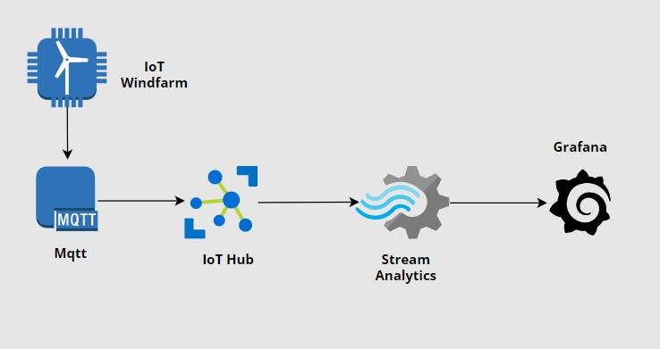

###  Azure IoT Telemetry Monitoring  

The Demo in this Repository, contains files for transferring data to Azure IoT Hub via MQTT protocol.
It extends further to show how to use this data to configure a Monitoring System using the following Azure services

* Azure Stream Analytics
* Power BI
* Azure blob storage

#### Create Infastructure : 

The terraform configuration file `main.tf` contains the infastructure codes. It creates the following resources:

* An IoT Hub Service
* An Azure Stream Analytics
* An Azure blob storage

Run `terraform apply` to create the infastructures.

#### Generate IoT data : 

`generate-data.py`, generates the IoT data used in this demo and connects to azure via MQTT using the Azure Python SDK

`from azure.iot.device.aio import IoTHubDeviceClient`

##### Uploads
https://user-images.githubusercontent.com/56255193/231018415-3cb3a2d4-b4ef-470a-8863-2bb2fe27d4a0.mp4

##### Stream data

Stream analytics is manually configured. It accepts input data from IoT hub and outputs it to Power BI and a storage container.

 

